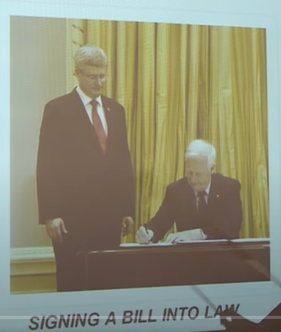
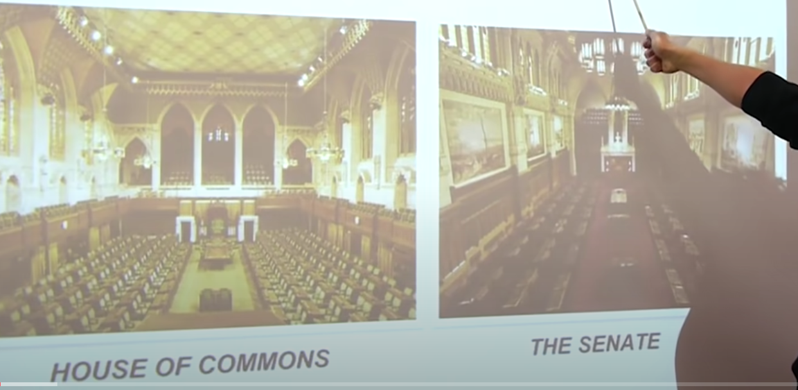
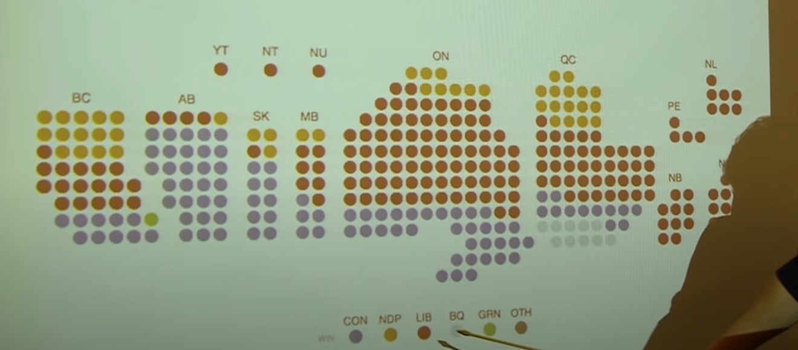
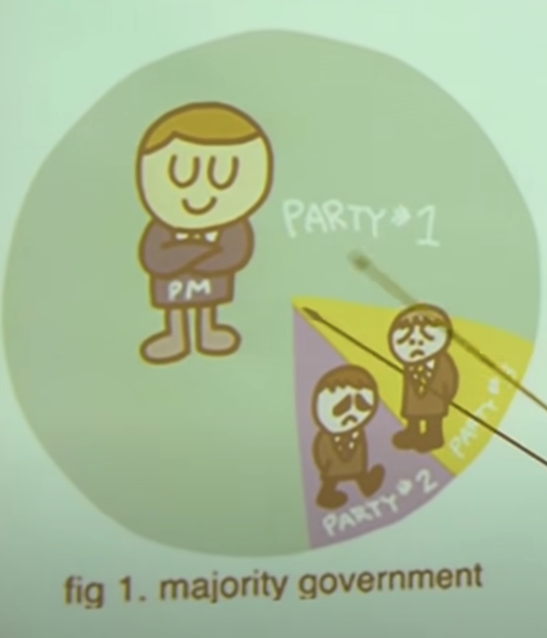
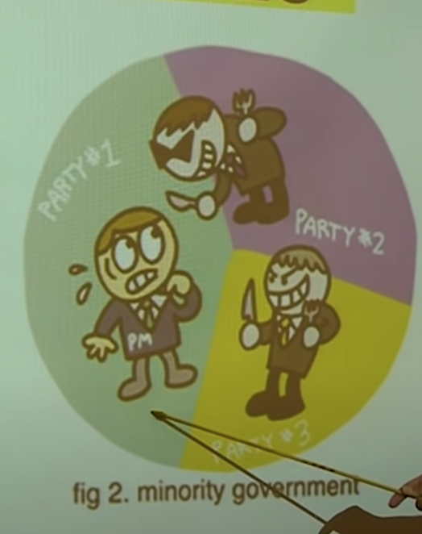
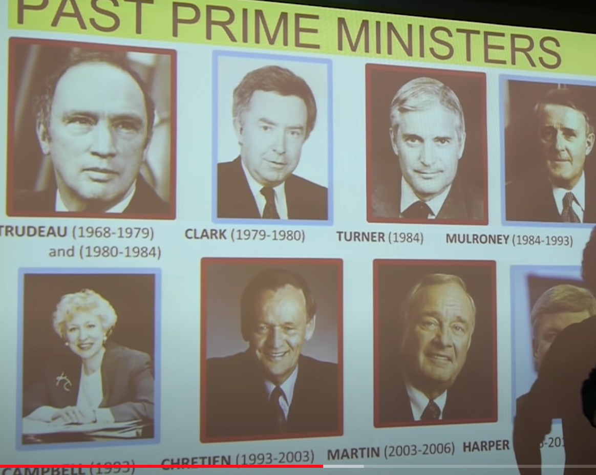
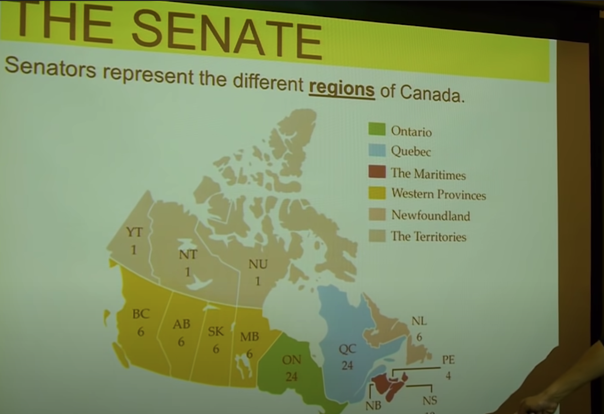
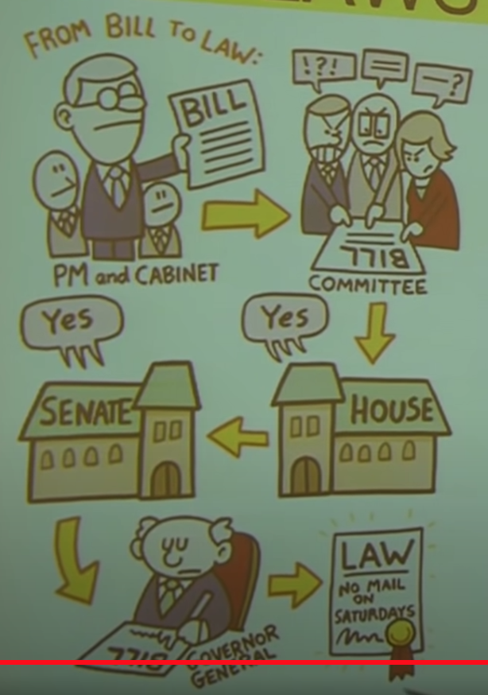
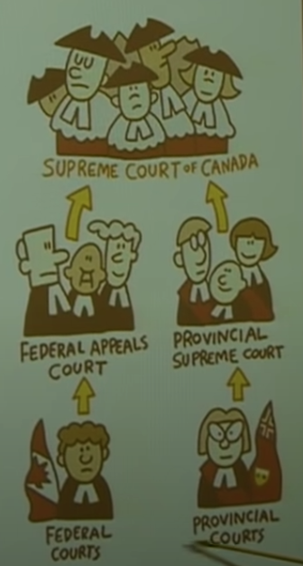
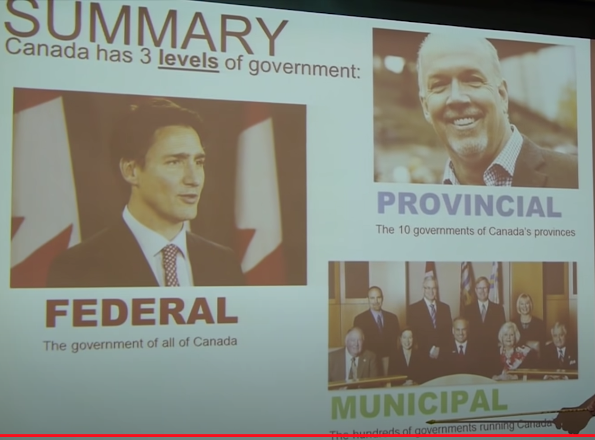

# Notes from class

Access it here: https://www.youtube.com/watch?v=ymEFFbcom88

* Canada is a:
    * Democracy:
        * A government that obeys the people. The people decides who stays in government and who does not. Before that, the country was ruled by British aristocrats 
    * Federal state:
        * Canada has many different levels of government that share power with each other. We have many government in Canada, every province has its own government and so does every city inside a province. That is the concept of federalism
    * Constitutional monarchy: 
        * Canada has a queen (a monarch) but she has only symbolic powers.
    * Parliamentary system:
        * Canada uses the English system of government where **decisions about our laws and leaders** are made by a body of **elected representatives**. The people elect those representatives since Canada is a democracy.
    * Responsible government: 
        The politicians of Canada must be responsible to the voters of Canada and our democratic, parliamentary traditions.

* The constitution
    * The Constitution of Canada is the document that provides the **rules** for how Canada system of government works and sets **limits** on the governments power.
    * This protects Canadian from the government to promote laws that could be harmful. We do not the government to pass laws that take away our rights, discriminate against us on the basis of our race, or gender, etc..

## National / Canada / Federal Government 

* The Queen
    * Queen Elizabeth the Second is Canada's monarch and head of the state. She is a symbol of Canada **history** and the **power** of the Canadian government and all laws are made in her name. She sometimes visits Canada to perform **ceremonial duties**.
        * She is head of state aka the most important political figure in the country.
        * 1982 Canada separated from the Great Britain.
            * On December 2, 1981, the Canadian House of Commons approved Trudeau's constitutional reform resolution with a vote of 246 to 24 (only the representatives from Quebec dissented), and on **April 17, 1982, Queen Elizabeth II declared Canada's independence from the British Parliament.**
        * She is the queen of Canada, Australia, New Zealand, Barbados, Jamaica, etc... All former British colonies 

* The Governor General 
    * The Governor General is a person who **represents the Queen in Canada**. He or she is appointed by the Government of Canada to perform certain symbolic duties.
    * The prime minister appoints the Government General.
    * When a law is passed by the parliament the government general signs it. Signing a bill to a law.
    * The Government General opens and closes the parliament.
    * Even though the Government General is more of a symbol, they do have a power under the constitution and they may even assume that power if something tragic happens to the prime minister.  
    * Bills are proposed laws that have to go through the process to be approved and then get signed by the chief executive of the state (governor) or country (president.) Once it is signed, it becomes law, though it normally won't go in effect immediately. Normally it has a specific date at which it becomes actual law.
        * 
        * The governor general of Canada (French: gouverneure générale du Canada)[n 1] is the federal viceregal representative of the Canadian monarch, currently Queen Elizabeth II. The Queen is head of state of Canada and the 14 other Commonwealth realms, but she resides in her oldest and most populous realm, the United Kingdom.
        * The Queen, on the advice of her Canadian prime minister,[1] appoints a governor general to carry on the Government of Canada in the Queen's name, performing most of her constitutional and ceremonial duties.
        * Julie Payette CC CMM COM CQ CD (French pronunciation: ​[ʒyli pajɛt]; born October 20, 1963) is a Canadian engineer, scientist and former astronaut who served from 2017 to 2021 as Governor General of Canada, the 29th since Canadian Confederation.[1][2][3]
        * **Mary Jeannie May Simon** CC CMM COM OQ CD FRCGS (Inuktitut: Ningiukudluk;[a] born August 21, 1947) is a Canadian civil servant, diplomat, and former broadcaster who has served as the 30th governor general of Canada since July 26, 2021.

* The Parliament of Canada
    * Canada's Parliament is divided into **two chambers**. **The House of Commons** which is elected and the **Senate** which is not elected.
    * 

* Political Parties of Canada
    * **A Prime Minister must be the boss of a political party**
    * Liberal Party
        * Justin Trudeau 
        * The Prime Minister of Canada
        * The boss of the Canadian Liberal Party 
        * Centre to centre-left
    * Conservative Party 
        * Erin O'Toole
        * The party sits at the centre-right to the right of the Canadian political spectrum, with their federal rivals, the Liberal Party of Canada, positioned to their left.
    * New Democratic Party (NDP)
        * Jagmeet Singh
        * centre-left to left-wing 
        * Indian, with immigrant parents 
        * Not a christian 
        * The 2020 British Columbia general election was held on October 24, 2020, to elect members of the Legislative Assembly to serve in the 42nd parliament of the Canadian province of British Columbia. The incumbent New Democratic Party of British Columbia won a majority government
    * Block Quebecois 
        * Yves-François Blanchet
        * They want to leave Canada and become their own country
    * Green Party of Canada
        * Amita Kuttner
        * More popular in BC. Lowest headcount in terms of MPs (Members of Parliament)
    * Note: **The prime minister (PM) is the head of the federal government. It is the most powerful position in Canadian politics. Prime ministers are not specifically elected to the position; instead, the PM is typically the leader of the party that has the most seats in the House of Commons.**

* The House of Commons 
    * The House of Commons consists of **338 representatives knowns as Members of Parliament (or MPs)** who are **elected** to represent the 338 different communities that make up Canada.
    * Canada has 338 little communities. Like even parts of a city (east vancouver, north vancouver, etc..)
    * When the map is chopped of it looks like this: 

    * The political party that can elect most MPs to the **House of Commons** forms the **government of Canada** and picks the **Prime Minister of Canada**. 

* Government Types
    * Majority government 
        * More common in Canada
        *  
    * Minority government 
        *  

* The Prime Minister
    * The Prime Minister is the **ruler of Canada** and the leader of the Canadian government. **He remains in power so long as he can keep the confidence of the majority of members of the House of Commons.**
    * Example: Paul Martin was prime minister from 2003 and 2006 but lost power when he could not keep the support of the House of Commons.

* Voting happens every 4 years, but if a Prime Minister does not have the majority of House of Commons, they can trigger an emergency voting to kick him/her out. **Emergency election** 

*  

* The Prime Minister runs the country with the help of **The Cabinet**.
    * The Prime Minister appoints MPs (Members of Parliament) from his own party to for his cabinet. Members of the cabinet are called **Ministers**.
    * Justin Trudeau made sure half of the **Ministers** are woman and the other half man. A lot of Cabinet Ministers are immigrants, not Christians, not white, etc.
    * Cabinet Minister of:
        * Finance
        * Relations with other countries 
        * Military
        * Womans affairs
        * Trade
        * etc..

* **The Senate**
    * 105 members called **Senators**
    * They are **not** appointed by the House of Commons. They are appointed by the Prime Minister (not elected by citizens / normal people).
    * Senators serve till their 75 birthday.
    * When the Canadian constitution was being written in 1867 not everybody thought democracy was the best idea. Having said that, they created two chambers of parliament.
    * The Prime Minister will appoint some Senators but not all of them since they can serve till they are 75. This brings senators from previous governments to the new government (appointed by the previous Prime Minister).
    * Senators are generally wealthy people, influential, smart, etc..

    * **The approval of both houses is necessary for legislation to become law, and thus the Senate can reject bills passed by the Commons.**

    * Different provinces are given a different number of Senators.

    * Senators represent different regions of Canada.

    *  

* How Laws are Made

    * Laws start as **Bills** which are **proposed by the Prime Minister and his cabinet (Ministers).**

    * They are discussed in a committee. The **committee** is a group of people formed by the **House of Commons**.
        * There is a **committee** for:
            * laws about Labour 
            * laws about Finance
            * laws about Trade

    * 

## Provincial Government 

* Every province has its **own independent government.** Provincial governments work very similar to Canadian Government (also called "Federal Government"). Remember, Canada is a Federal State.

* Governor General = Lieutenant-Governor 
* Prime Minister = Premier 
* Parliament of Canada = Legislative Assembly of BC
* MP (Member of Parliament) = MLA (Member of Legislative Assembly)

* Provincial Governments **DO NOT HAVE A SENATE**

* Division of Power
    * Canadian Government and Provincial Government have **different powers** and can only **make laws about certain things**.
    * Canadian Government 
        * Serious crimes (murder, theft, etc)
        * Military
        * Coins and paper money
        * Relations with other countries
        * Citizenship
    
    * Provincial Government 
        * Schools
        * Hospitals
        * Oil, gas, electricity 
        * Highways
        * Buses and bridges 
    
    * We pay the Goods and Services Tax (GST) for the Canadian Government / Federal Government (Federal Income Tax)
    * We also pay our PST (Provincial Service Tax), but that is for the Provincial Government 

## City Government (also known as Municipal Government)

* Governments created by the Provinces to help govern smaller communities within a province.

* Powers
    * Garbage collection (run by the city government)
    * Libraries 
    * Sewers 
    * Property / construction
    * Regulation of business 

* The leader of a city if called a **Mayor**. The parliament of a city is called the **city council**. They are all elected by votes.

## The Courts

* Canada's courts are the bodies that **enforces the laws** of Canada and punish people who are guilty of breaking the law.

* There are different **levels** of courts in Canada that handles different sorts of law. Court decisions can be **appealed** up to the higher level.

* **The Supreme Court of Canada** is the highest level of court and can **throw out laws** that they think violate the Canadian Constitution.

* Most **Court Judges** are appointed by the **Prime Minister** or provincial **Premier**.

*  

* The courts are like the senate, you generally get to stay till you hit 75 years old.

## Voting

* Any Canadian citizen **over 18 years old** can vote in any federal, provincial, or city election. **You can only vote for politicians representing the city that you live**

* House of Commons elections happens every 4 years in October.
* Provincial elections are every 4 years in May

*  

* Politicians belong to 3 branches:

    * Executive
        * Leaders of government that carry out laws
            * Federal 
                * Queen
                * Prime Minister
                * Governor General 
                * The Cabinet (Ministers)
            * Provincial
                * The premier 
                * The premiers cabinet 
            * Municipal 
                * The Mayor

    * Legislative 
        * Groups of people that pass the law
            * Federal
                * House of Commons
                * Senate 
            * Provincial
                * Provincial assembly 
            * Municipal
                * City council 

    * Judicial 
        * Enforce the laws or sometimes rejects them
            * Federal
                * Federal Court
                * Supreme Court
            * Provincial
                * The provincial courts
            * Municipal
                * City courts 